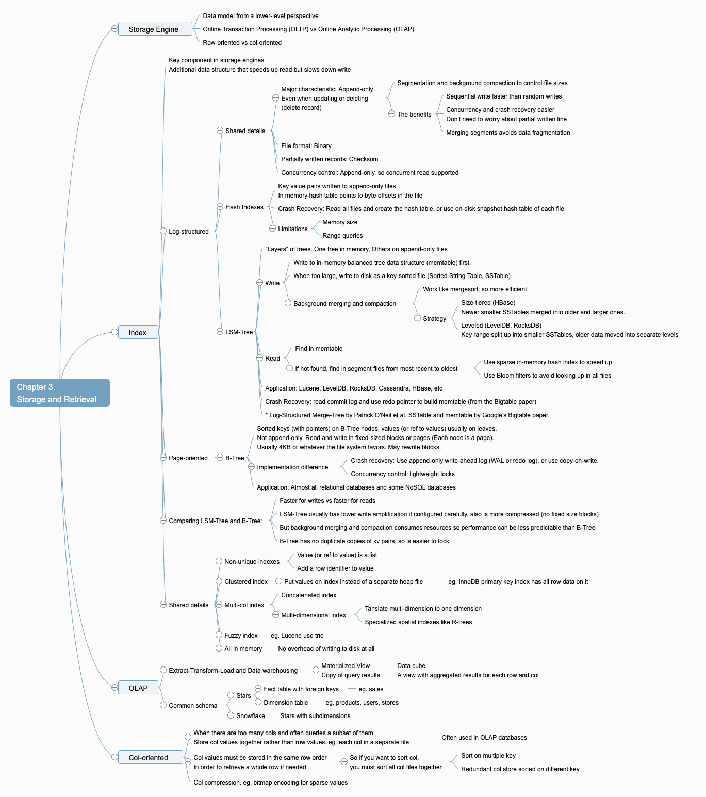
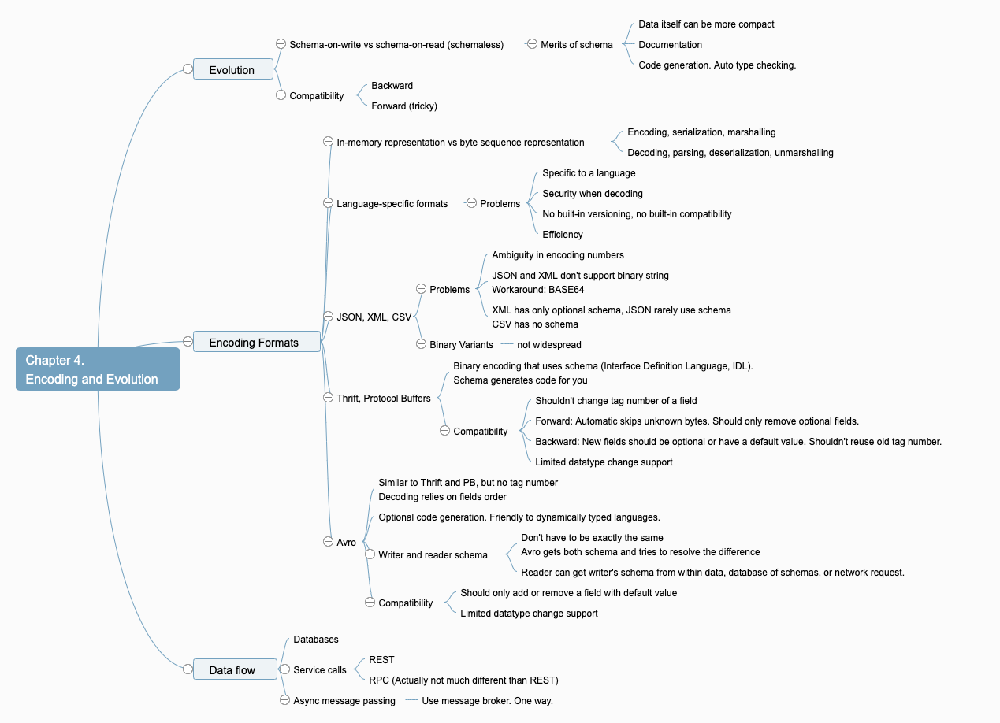
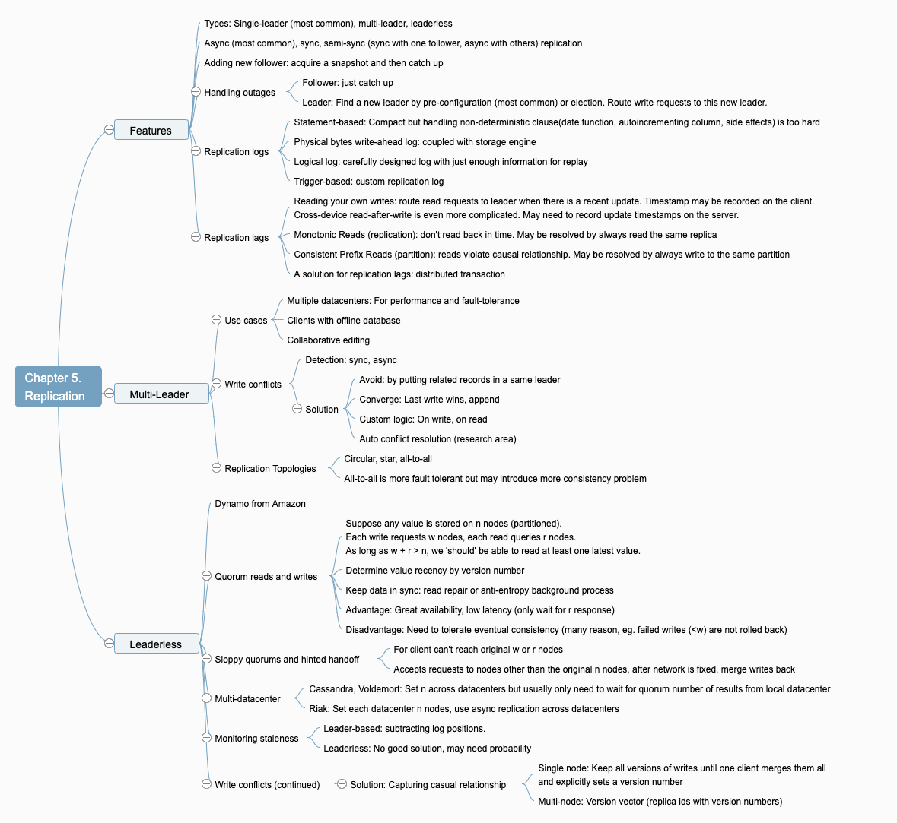
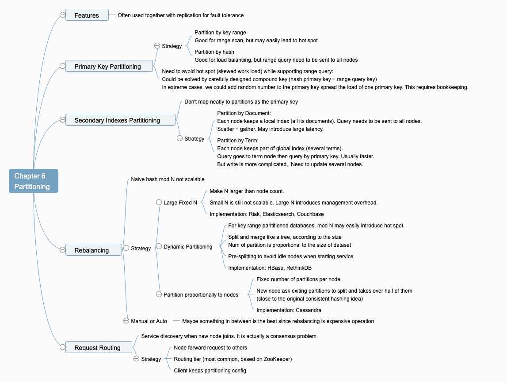

# Designing Data-Intensive Applications

## 1. Reliable, Scalable, and Maintainable Applications

## 2. Data Models and Query Languages

## 3. Storage and Retrieval

## 4. Encoding and Evolution

A note on B-tree lightweight lock for concurrency control: My intuition is that we can use a R/W lock on the nodes we visited.

## 5. Replication

## 6. Partitioning

### Consistent hashing

A hashing strategy for easier rebalancing. Used both in data partitioning and request load balancing.

Map nodes and keys into a same space using a same hash function. A key would be stored on the node with a successor hashed value. Concatenate the begin and the end of this hashed space so every key has a node successor.

### Other view of paritioning

#### From the Grokking the System Design Interview course in my words

- Layers of paritioning:
  - Partition by key. Lowest level. This is often what we talk about when discussing partitioning.
  - Partition by feature. Different service storages could be considered to be partitions of one large system.
  - Partition query layer. The level closest to the application. At this level we can add a service to abstracts away the detail of partitioning methods and make life easier for application writers.
- Partitioning Criteria
  - Hash (+ mod N round robin)
  - Key range
  - Compound: hash + key range
- Common problems
  - Joins are usually not supported because of inefficiency: may be solved by denormalization (keep redundant information).
  - Foreign key constraints not supported: implement in the application
  - Rebalancing

## 8. The Trouble with Distributed Systems

