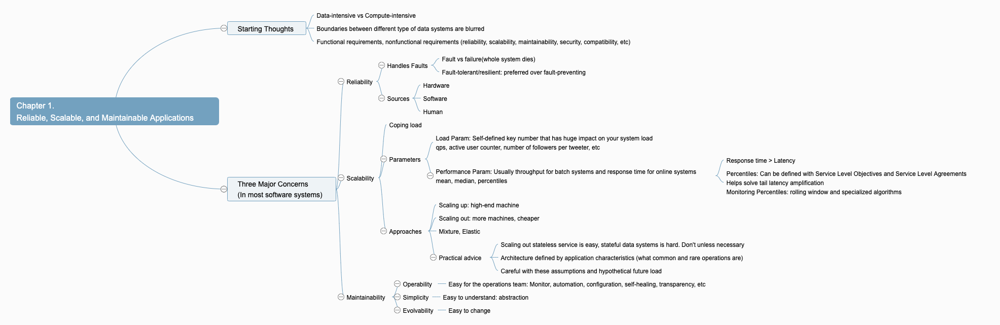
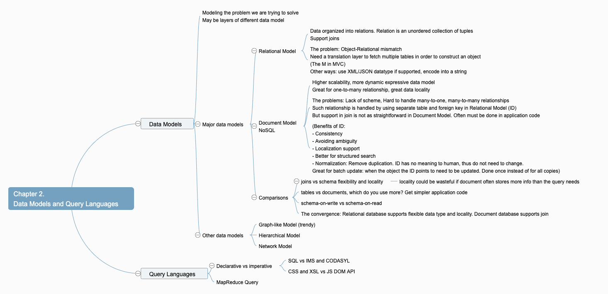
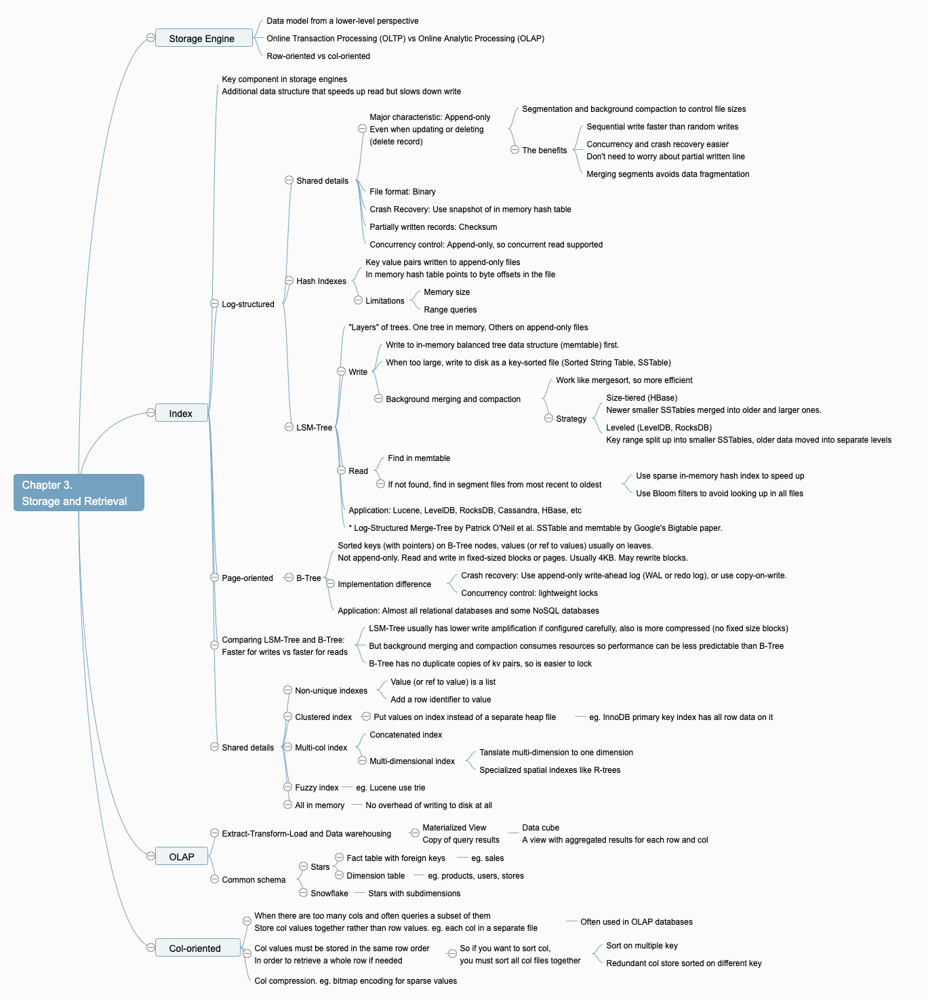
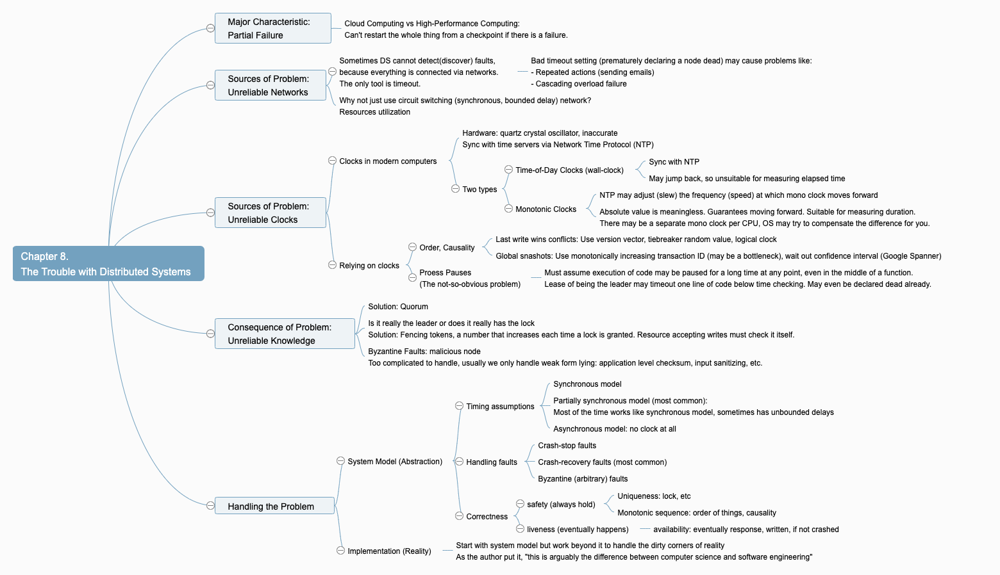

# Designing Data-Intensive Applications

## 1. Reliable, Scalable, and Maintainable Applications

## 2. Data Models and Query Languages

### Storage Engine

#### Data model from a lower-level perspective

#### Online Transaction Processing (OLTP) vs Online Analytic Processing (OLAP)

#### Row-oriented vs col-oriented

### Index

#### Key component in storage engines
Additional data structure that speeds up read but slows down write

#### Log-structured

##### Shared details

###### Major characteristic: Append-only
Even when updating or deleting
(delete record)

####### Segmentation and background compaction to control file sizes

####### The benefits

######## Sequential write faster than random writes

######## Concurrency and crash recovery easier
Don't need to worry about partial written line

######## Merging segments avoids data fragmentation

###### File format: Binary

###### Crash Recovery: Use snapshot of in memory hash table

###### Partially written records: Checksum

###### Concurrency control: Append-only, so concurrent read supported

##### Hash Indexes

###### Key value pairs written to append-only files
In memory hash table points to byte offsets in the file

###### Limitations

####### Memory size

####### Range queries

##### LSM-Tree

###### "Layers" of trees. One tree in memory, Others on append-only files

###### Write

####### Write to in-memory balanced tree data structure (memtable) first.

####### When too large, write to disk as a key-sorted file (Sorted String Table, SSTable)

####### Background merging and compaction

######## Work like mergesort, so more efficient

######## Strategy

######### Size-tiered (HBase)
Newer smaller SSTables merged into older and larger ones.

######### Leveled (LevelDB, RocksDB)
Key range split up into smaller SSTables, older data moved into separate levels

###### Read

####### Find in memtable

####### If not found, find in segment files from most recent to oldest

######## Use sparse in-memory hash index to speed up

######## Use Bloom filters to avoid looking up in all files

###### Application: Lucene, LevelDB, RocksDB, Cassandra, HBase, etc

###### * Log-Structured Merge-Tree by Patrick O'Neil et al. SSTable and memtable by  Google's Bigtable paper.

#### Page-oriented

##### B-Tree

###### Sorted keys (with pointers) on B-Tree nodes, values (or ref to values) usually on leaves.
Not append-only. Read and write in fixed-sized blocks or pages. Usually 4KB. May rewrite blocks.

###### Implementation difference

####### Crash recovery: Use append-only write-ahead log (WAL or redo log), or use copy-on-write.

####### Concurrency control: lightweight locks

###### Application: Almost all relational databases and some NoSQL databases

#### Comparing LSM-Tree and B-Tree:
Faster for writes vs faster for reads

##### LSM-Tree usually has lower write amplification if configured carefully, also is more compressed (no fixed size blocks)

##### But background merging and compaction consumes resources so performance can be less predictable than B-Tree

##### B-Tree has no duplicate copies of kv pairs, so is easier to lock

#### Shared details

##### Non-unique indexes

###### Value (or ref to value) is a list

###### Add a row identifier to value

##### Clustered index

###### Put values on index instead of a separate heap file

####### eg. InnoDB primary key index has all row data on it

##### Multi-col index

###### Concatenated index

###### Multi-dimensional index

####### Tanslate multi-dimension to one dimension

####### Specialized spatial indexes like R-trees

##### Fuzzy index

###### eg. Lucene use trie

##### All in memory

###### No overhead of writing to disk at all

### OLAP

#### Extract-Transform-Load and Data warehousing

##### Materialized View
Copy of query results

###### Data cube
A view with aggregated results for each row and col

#### Common schema

##### Stars

###### Fact table with foreign keys

####### eg. sales

###### Dimension table

####### eg. products, users, stores

##### Snowflake

###### Stars with subdimensions

### Col-oriented

#### When there are too many cols and often queries a subset of them
Store col values together rather than row values. eg. each col in a separate file

##### Often used in OLAP databases

#### Col values must be stored in the same row order
In order to retrieve a whole row if needed

##### So if you want to sort col,
you must sort all col files together

###### Sort on multiple key

###### Redundant col store sorted on different key

#### Col compression. eg. bitmap encoding for sparse values

## 3. Storage and Retrieval

## 8. The Trouble with Distributed Systems

