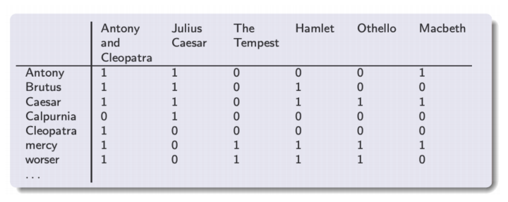
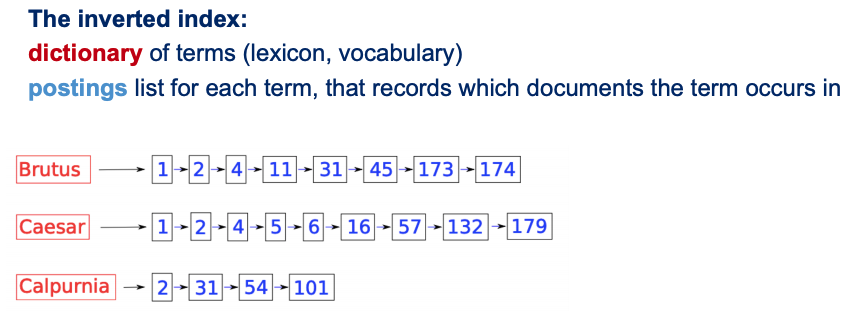
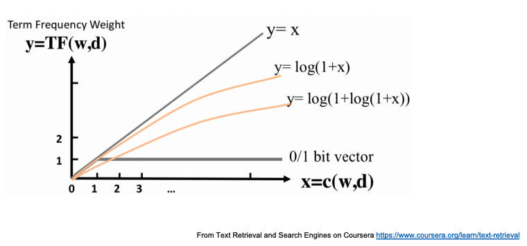
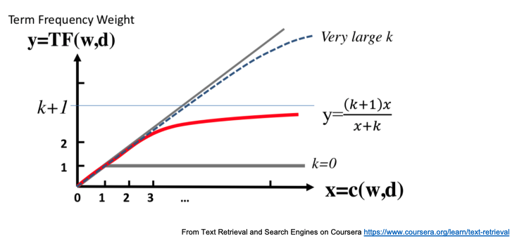

# Information Retrieval

This note mainly focuses on text information retrieval. It is based on JHU's, ETHzurich's and Stanford's information retrieval course.

## Overview

Data -> Search -> User

More detail:

-   Data: Getting documents and preprocessing documents
    -   Crawler
    -   Text preprocessing, Clustering, Information Extraction (Named Entity, Relation, Topic Models, etc.)
    -   Forward Index, Inverted Index
-   Search: Querying content (Search engine) or filtering content (Recommendation system). Not different that much.
    -   Querying: Boolean Retrieval, Vector Space Model, Probabilistic Model
    -   Filtering: Content Filtering, Collaborative Filtering, Also use Querying methods
    -   Ranking: Scoring, Link Analysis
-   User: Content presentation

## Retrieval In General

-   The way user accessing data: Push mode (Recommendation system like news feed) -> filtering content and Pull model (Search engine) -> querying content.
-   Retrieval compared to Database: Database usually holds structured data, with well-defined query semantics.
-   Know that user information need is almost always larger than the given query.
-   Search core methods: Selection (binary decision) or Ranking (Continous scoring and thresholding). If we assume the utility of a document to a user is independent of any other document and the usesr browse the results sequentially, we could rank documents in descending order of the probability that a document is relevant to the query.
-   Search results evaluation: Precision and Recall.

## Text preprocessing

-   Tokenization
-   Stemming

## Boolean Retrieval

0. First we need to scan each document and extract (docId, term) pairs from each document. Now we need a efficient way to lookup docId given terms.

1. Intuition: Build a Term-Document incidence matrix

    <table>
        <thead>
            <tr>
                <th colspan=2 rowspan=2></th>
                <th colspan=4>documents</th>
            </tr>
            <tr>
                <th>doc0</th>
                <th>doc1</th>
                <th>...</th>
                <th>doc|d|</th>
            </tr>
        </thead>
        <tbody>
            <tr>
                <th rowspan=4>terms</th>
                <th>term0</th>
                <td>is_in(term0, doc0)</td>
                <td></td>
                <td></td>
                <td></td>
            </tr>
            <tr>
                <th>term1</th>
                <td></td>
                <td>...</td>
                <td></td>
                <td></td>
            </tr>
            <tr>
                <th>...</th>
                <td></td>
                <td></td>
                <td>...</td>
                <td></td>
            </tr>
            <tr>
                <th>term|V|</th>
                <td></td>
                <td></td>
                <td></td>
                <td>is_in(term|V|, doc|d|)</td>
            </tr>
        </tbody>
    </table>

    Each cell in the table body is a binary weight describing if a document contains a term. Eg:

    

    But this table will be massive if |V|\*|d| is large. 

2. Instead, we use Inverted Index.

    

3. Do boolean operations on terms with AND, OR, NOT operators. Eg: {doc result} = f(term0 OR (term1 AND NOT term2)).

    Small optimization: Reorder terms of boolean operation in increasing document frequency (how many document this term appears in) to reduce unneccessary works.

### Index Construction

-   Hash Table, B+ Tree 
-   First step is to scan each document and extract (docId, term) pairs from each document. But the number of pairs may be too large to fit into memory or to sort in disk. So how to build large inverted index efficiently?
    -   Block sort-based Indexing:
        -   Keep a termId-term table on the fly or in batch, to reduce (docId, term) pair size
        -   Divide documents into chunks. Chunk by chunk, pull from disk into memory. Extract t pair of (docId, termId). T in total. Time complexity is O(T).
        -   Sort the pairs by termId_docId and merge them with termId as the key. Then write merged termId-docIds back into disk. O(TlogT) in total.
        -   Open all chunks on disk simultaneously. Read line by line and merge and write to final inverted index. O(T) in total. Because it is disk operation so O(T) becomes dominant.
    -   Single-pass in memory Indexing:
        -   Divide documents into chunks. Chunk by chunk, read each document and build term-docIds map on the fly. Still we assume t pair of (docId, termId). T in total. D documents. Time complexity is O(T) because docId is already in order.
        -   Sort the map by term. Then write back into disk. O(DlogD) in total.
        -   Same as Block sort-based Indexing. O(T) still dominates.
-   Distributed indexing: Use MapReduce.
        -   mapper: Extract pairs from document
        -   reducer: Get all pairs of one (or more) term(s). Sort by docId and write merged term-docIds into disk.
-   Dynamic indexing: To efficiently get incremental changes.
    -   Main index plus a incremental auxiliary index, which is periodically merged into main index. The cost of merge is associated with the number of indexes. The more the better. In reality we often choose a compromise between the two extreme. For example logarithmic merge indexes (detail omitted here).
    -   Dual main index switching.

### Index Compression

-   Dictionary Compression: Focusing on compressing term string
    -   Dictionary as a string: Instead of giving fixed-width length to terms, we first concat terms into a single long string in order of inverted index and record only the position of each term.
    -   Blocked Storage: Instead of recording all the positions of terms, we record every *k*th term position and keep each term length in front of each term in the concated string. When walking down the B+ tree in search of a term, we found the *k* length section the term is in and then do a linear scan.
    -   Front coding: When concatenating terms in order, omit same prefixes and use some special symbols and numbers representing suffixes length.
-   Postings Compression: TODO

## Ranked Retrieval

-   Jaccard Coefficient: \|query terms AND doc terms\| / \|query terms OR doc terms\|. But it does not consider term frequency, rarity (informative) and document length.
-   Term-Document frequency matrix: Recall the Term-Document incidence matrix. Instead of putting binary number in the cell, we count how many times a term appears in a document.
    -   Bag of words model: A document is represented by a vector of word counts. It does not consider order of words.
    -   Notice that relevance does not increase proportionally with term frequency. So we could use some transformation to discount the effect of term frequency:

    Sublinear Transformation:

    

    BM25 Transformation:

    

-   Query document scoring: Considering term frequency.

    Define log frequency weight of term t in d:

    

    )

-   idf: Considering rarity (informative). It only starts working when there are two or more terms in a query.

     is the number of document that contain t. Minimum set to 1.

    %7D)

    Use log to dampen the effect of idf.

    Summing up, we have tf-idf model:

    TODO

    Score = 

### Vector Space Model

-   tf-idf weight matrix: Each cell is now a tf-idf score.

    <table>
        <thead>
            <tr>
                <th colspan=2 rowspan=2></th>
                <th colspan=4>documents</th>
            </tr>
            <tr>
                <th>doc0</th>
                <th>doc1</th>
                <th>...</th>
                <th>doc|d|</th>
            </tr>
        </thead>
        <tbody>
            <tr>
                <th rowspan=4>terms</th>
                <th>term0</th>
                <td>tf_idf(term0, doc0)</td>
                <td></td>
                <td></td>
                <td></td>
            </tr>
            <tr>
                <th>term1</th>
                <td></td>
                <td>...</td>
                <td></td>
                <td></td>
            </tr>
            <tr>
                <th>...</th>
                <td></td>
                <td></td>
                <td>...</td>
                <td></td>
            </tr>
            <tr>
                <th>term|V|</th>
                <td></td>
                <td></td>
                <td></td>
                <td>tf_idf(term|V|, doc|d|)</td>
            </tr>
        </tbody>
    </table>

-   Each document can now be represented by a high dimentional vector (a column). In boolean retrieval model, each vector is filled with binary values. In naive bag of words model, each vector is filled with term frequency as values. In tf-idf model, each vector is filled with tf-idf scores.

## Skipped Contents:

-   Ranked Retrieval: Parametric search, learning weights