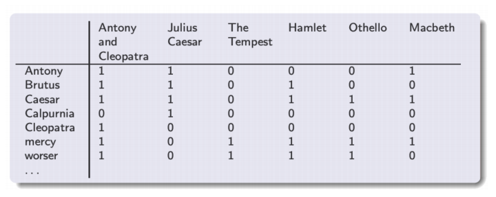
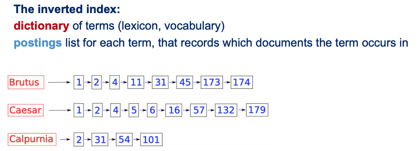
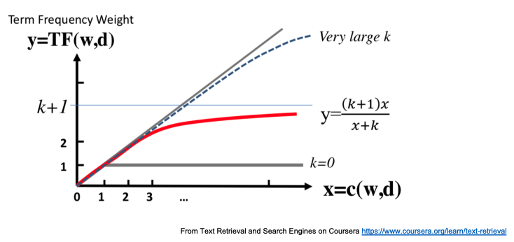
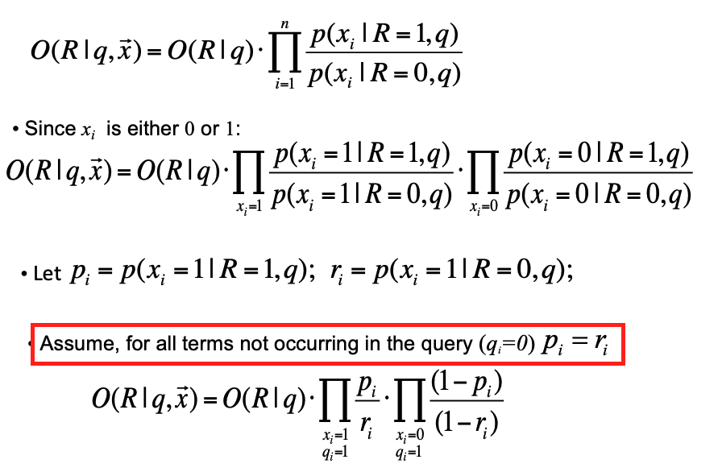

# Ad Hoc Retrieval

This part we dicuss the fundamental techniques of retrieval when the system is presented with a user query.

## Boolean Retrieval

0. First we need to scan each document and extract (docId, term) pairs from each document. Now we need a efficient way to lookup docId given terms.

1. Intuition: Build a Term-Document incidence matrix

    <table>
        <thead>
            <tr>
                <th colspan=2 rowspan=2></th>
                <th colspan=4>documents</th>
            </tr>
            <tr>
                <th>doc0</th>
                <th>doc1</th>
                <th>...</th>
                <th>doc|d|</th>
            </tr>
        </thead>
        <tbody>
            <tr>
                <th rowspan=4>terms</th>
                <th>term0</th>
                <td>is_in(term0, doc0)</td>
                <td></td>
                <td></td>
                <td></td>
            </tr>
            <tr>
                <th>term1</th>
                <td></td>
                <td>...</td>
                <td></td>
                <td></td>
            </tr>
            <tr>
                <th>...</th>
                <td></td>
                <td></td>
                <td>...</td>
                <td></td>
            </tr>
            <tr>
                <th>term|V|</th>
                <td></td>
                <td></td>
                <td></td>
                <td>is_in(term|V|, doc|d|)</td>
            </tr>
        </tbody>
    </table>

    Each cell in the table body is a binary weight describing if a document contains a term. Eg:

    

    But this table will be massive if |V|\*|d| is large. 

2. Instead, we use Inverted Index.

    

    Notice that the documents are ordered by docId. This allows us to do quick intersection.

3. Do boolean operations on terms with AND, OR, NOT operators. Eg: {doc result} = f(term0 OR (term1 AND NOT term2)).

    Small optimization: Reorder terms of boolean operation in increasing document frequency (how many document this term appears in) to reduce unneccessary works.

## Index Construction

-   Hash Table, B+ Tree 
-   First step is to scan each document and extract (docId, term) pairs from each document. But the number of pairs may be too large to fit into memory or to sort in disk. So how to build large inverted index efficiently?
    -   Block sort-based Indexing:
        -   Keep a termId-term table on the fly or in batch, to reduce (docId, term) pair size
        -   Divide documents into chunks. Chunk by chunk, pull from disk into memory. Extract t pair of (docId, termId). T in total. Time complexity is O(T).
        -   Sort the pairs by termId_docId and merge them with termId as the key. Then write merged termId-docIds back into disk. O(TlogT) in total.
        -   Open all chunks on disk simultaneously. Read line by line and merge and write to final inverted index. O(T) in total. Because it is disk operation so O(T) becomes dominant.
    -   Single-pass in memory Indexing:
        -   Divide documents into chunks. Chunk by chunk, read each document and build term-docIds map on the fly. Still we assume t pair of (docId, termId). T in total. D documents. Time complexity is O(T) because docId is already in order.
        -   Sort the map by term. Then write back into disk. O(DlogD) in total.
        -   Same as Block sort-based Indexing. O(T) still dominates.
-   Distributed indexing: Use MapReduce.
        -   mapper: Extract pairs from document
        -   reducer: Get all pairs of one (or more) term(s). Sort by docId and write merged term-docIds into disk.
-   Dynamic indexing: To efficiently get incremental changes.
    -   Main index plus a incremental auxiliary index, which is periodically merged into main index. The cost of merge is associated with the number of indexes. The more the better. In reality we often choose a compromise between the two extreme. For example logarithmic merge indexes (detail omitted here).
    -   Dual main index switching.

## Index Compression

-   Dictionary Compression: Focusing on compressing term string
    -   Dictionary as a string: Instead of giving fixed-width length to terms, we first concat terms into a single long string in order of inverted index and record only the position of each term.
    -   Blocked Storage: Instead of recording all the positions of terms, we record every *k*th term position and keep each term length in front of each term in the concated string. When walking down the B+ tree in search of a term, we found the *k* length section the term is in and then do a linear scan.
    -   Front coding: When concatenating terms in order, omit same prefixes and use some special symbols and numbers representing suffixes length.
-   Postings Compression: TODO

## Ranked Retrieval

-   Find documents based on score and we can control the number of most relevent documents to show in the end.
-   Jaccard Coefficient: \|query terms AND doc terms\| / \|query terms OR doc terms\|. But it does not consider term frequency, rarity (informative) and document length.
-   Term-Document frequency matrix: Recall the Term-Document incidence matrix. Instead of putting binary number in the cell, we count how many times a term appears in a document.
    -   Bag of words model: A document is represented by a vector of word counts. It does not consider order of words.
    -   Notice that relevance does not increase proportionally with term frequency. So we could use some transformation to discount the effect of term frequency:

    Sublinear Transformation:

    

    BM25 Transformation:

    

-   Query document scoring: Considering term frequency.

    Define log frequency weight of term t in d:

    

    )

-   idf: Considering rarity (informative). It only starts working when there are two or more terms in a query.

     is the number of document that contain t. Minimum set to 1.

    %7D)

    Use log to dampen the effect of idf.

    Summing up, we have tf-idf model:

    TODO

    Score = 

### Vector Space Model

-   tf-idf weight matrix: Each cell is now a tf-idf score.

    <table>
        <thead>
            <tr>
                <th colspan=2 rowspan=2></th>
                <th colspan=4>documents</th>
            </tr>
            <tr>
                <th>doc0</th>
                <th>doc1</th>
                <th>...</th>
                <th>doc|d|</th>
            </tr>
        </thead>
        <tbody>
            <tr>
                <th rowspan=4>terms</th>
                <th>term0</th>
                <td>tf_idf(term0, doc0)</td>
                <td></td>
                <td></td>
                <td></td>
            </tr>
            <tr>
                <th>term1</th>
                <td></td>
                <td>...</td>
                <td></td>
                <td></td>
            </tr>
            <tr>
                <th>...</th>
                <td></td>
                <td></td>
                <td>...</td>
                <td></td>
            </tr>
            <tr>
                <th>term|V|</th>
                <td></td>
                <td></td>
                <td></td>
                <td>tf_idf(term|V|, doc|d|)</td>
            </tr>
        </tbody>
    </table>

-   Each document can now be represented by a high dimentional vector (a column). In boolean retrieval model, each vector is filled with binary values. In naive bag of words model, each vector is filled with term frequency as values. In tf-idf model, each vector is filled with tf-idf values.

-   Now we can represent query as a same kind of vector, then give each document a score based on the similarity between the query vector and the document vector. Because we care more about the distribution of terms than raw value in the vector, we use cosine similarity instead of Euclidean distance.

-   Same reason as in Boolean Retrieval, we actually do not use table but use inverted index. So to calculate cosine similarity between the query and documents, we iterate postings of each query term and accumulate a score for each document. The terms not presented in the query are not traversed at all since they would be 0 anyway. Then we noramlize the scores by dividing the length of query vector and the corresponding document vector length. Finally we extract the top scoring documents we needed.

    This algorithm is described in detail below:

    

    If we loop through query terms one-by-one to accumulate document scores, it is called term-at-a-time algorithm. Else we could open all terms postings together like the intersection algorithm in boolean retrieval and iterate postings by the order of docIds. Then we are accumulating scores document by document. This is called document-at-a-time algorithm.

-   Optimization:

    -   Tf-idf is a floating point number which takes up a lot of space. Since all idf values of a term is the same, we can actually store the idf value at the postings list head and only keep the tf values in the postings. 

    

    -   All scores are normalized by the length of query vector, so we can just omit this part.
    -   We only need to compute the length of documents query terms appear in.
    -   To find the top documents, we either use QuickSelect, or use Min Heap to only keep the number of the documents we wanted on the fly.

-   Variants of tf-idf:

    

    Also you can use different weighting schemes on query and document.

-   Furthur Optimization, with approximation:

    -   Query terms tf are usually 1, so we can omit them.
    -   Idf are the same for query term and document term, we can change the scoring scheme and leaves only document term idf.

    Summing up, we have the following:

    

### Optimization and Other Scoring Methods

From exact top k document retrieval to inexact top k.

-   Index elimination
    -   Leave only postings lists with high idf.
    -   Leave only documents which contain a large number of terms.
-   Champion lists: For each postings list, leave only corresponding r documents with high tf value. Each term could contribute different number of 'champion' document according to our custom settings. In the end we could compute scores for documents in the union of all champion lists.

    One potential problem here is that the postings would be sorted by tf values instead of docIds. This should make our quick intersection or document-at-a-time algorithm impossible. So we could keep a separate inverted index ordered by docIds.

    -   Static quality score: Suppose each document has a static quality score irrelevant to the query and it is used in the final scoring, for example PageRank score that evaluates page importance or authority. Maybe something like final_score = static_score + cosine_similarity. We then could find 'champion' documents by these two ways:

        1.  Sory by static_score + max tf-idf value of the document. We have a global champion list of documents.

            This also poses the problem of postings order, which are now in the order of this static sorting score instead of docIds. This is supposed to make our quick intersection or document-at-a-time algorithm impossible. But in fact, as long as all documents in postings lists share an universal ordering scheme, we can still do it in one pass!

        2.  Sort by static_score + tf-idf. We have a champion list for each term.

            This is a direct combination of static quality score and champion list. We would need to keep a separate inverted index ordered by docIds in order to use quick intersection or document-at-a-time algorithm. 

    -   Tiered indexes: If r is chosen too small, we may find no documents at all in the end. We could keep multiple backup champion lists and fallback to them when we could not find enough k documents.

-   Impact ordering: We sort postings lists by idf and sort each postings by static_score + tf like in the champion list. Then we accumulate documents scores in order until new scores are below threshold or we have accumulated more than enough documents. Notice we can only use term-at-a-time algorithm in this manner.

    

-   Cluster pruning: Pick a subset (maybe square root of the number of all documents) of documents randomly as leaders and do one round of k-means to cluster all documents around these leaders. When we are computing scores we only compute for documents in the cloest cluster to the query vector.

    Of course we can try other variant methods like doing more rounds of k-means or assigning documents to more than one leader.

-   Query term proximity: Users prefer docs in which query terms occur within close proximity of each other. This is a very different scoring methods from discussed above that requires a custom scoring module.

-   Query parser and custom scoring: In fact, modern search engine often uses a combination of retrieval methods to get different results and aggregating scores from multiple custom scoring methods to rank the different results.

### Probabilistic Model

In traditional IR systems, matching between each document and query is attempted in a semantically imprecise space of index terms. Probabilities provide a principled foundation for uncertain reasoning. The principle is to return documents by decreasing order of relevance probabilities.

#### Binary Independence Model

Binary: documents and queries are represented as binary incidence vectors of terms (**x** and **q**) like in boolean retrieval.  Independence: Using naive bayes assumption, assuming terms occur in documents independently. Using the principle of probability ranking, we need to rank documents according to **p(R=1|q,x)**.

-   The math (skip this if you want to): Using odds and Bayes' Rule, we rank documents by odds:

    

    Since we are only interested in ranking, factors unrelated to documents can be ignored:

    
    

    

    Here **p** is the probability of a term appearing in a document relevant to the query. **r** is the probability of a term appearing in a nonrelevant document.

    

    

-   BIM RSV: Finally we have the retrieval status value for ranking:

    

    In this equation, we let  be the log odds ratios. Then:

    %7D%7Br_i(1-p_i)%7D%20%3D%20%5Clog%20%5Cfrac%7Bp_i%7D%7B1-p_i%7D%20%2B%20%5Clog%20%5Cfrac%7B1-r_i%7D%7Br_i%7D)

     is the odds of the term appearing if the document is relevant.  is odds of the term appearing if the document is nonrelevant. The log odds ratio is the ratio of these two odds. So more likely a term appears in a relevant document, larger the this ratio. This is why the retrieval status value could act as term weight. And the sum is document score.

-   Estimating .

    -    Maximum likelihood estimate: In theory, we can count from the whole document collection to get  and :

    

    This called Maximum likelihood estimate. We can also use smoothing to avoid dividing zero and gives some probability to events we haven't seen in the document. A simple way is to add a small pseudocounts to each observed count. These pseudocounts act as a Bayesian prior and denotes the strength of our (small) belief in uniformity. This is call maximum a posterior estimation.

    -   Estimating  in practice: Assuming relevant documents are a very small percentage of the collection:

    

    -   Estimating  in practice: There are three ways:

        -   Relevance feedback: Use the frequency of term in know relevant documents.
        -   Just give it a constant 0.5. Only IDF is left in retrieval status value.
        -   From collection level statistics, .

    -   Relevance feedback: TODO

-   Summary of assumptions in BIM:

    -   Relevance of each document is independent of others
    -   Naive Bayes Assumption: Term are independent of each other given query and document relevance
    -   Terms not in the query are equally likely in relevant and irrelevant documents. They don't affect outcome.
    -   Boolean representation of term/document/query/relevance
    -   Estimating : query words appear half of the relevant documents
    -   Estimating : Most documents are not relevant given query. |non-relevant| ≈ |doc. collection|

#### BM25

Best Match 25, since 1994. Its goal is to be sensitive to term frequency and document
length while not adding too many parameters. It relaxes the assumption of term independence and boolean representation of term/document/query/relevance above. It also takes into consideration of document length. 

-   Background (skip this if you want to): Assuming a generative model. Words are drawn from vocabulary using a multinomial distribution. So the term frequency obeys binomial distribution. Assuming documents are very long compared to a term, we use Poisson distribution to approximate binomial distribution (see why is it legit [here](https://math.stackexchange.com/a/1050233)). But with this model, we cannot predict topic-specific terms that appear a lot in some documents and not once in others. So we introduce another binary hidden variable Eliteness between document and term frequency to describe if a term matches the topic of the document.

    Similar to BIM, we derive a retrieval status value by considering term frequency:

    

    Combined with our Poisson term frequency model, we get the 2-Poisson model for term frequency:

    

    But there are too many unknown parameters. Here we have a look at the graph for $$c^{elite}_i({tf}_i)$$:

    

-   Elite RSV: We can approximate $$c^{elite}_i({tf}_i)$$ with the Saturation function: $$\frac{\mathit{tf}}{k_1 + \mathit{tf}}$$

    

    We usually add a $$k_1+1$$ to the numerator to provide a lower bound 1 to this function.

    Finally we consider the document length by normalizing the term frequency with a length normalization component:

    

-   Using the $$c^{elite}_i({tf}_i)$$ with length normalization component and $$c^{\text{BIM}}_i$$. We get BM25 model:

    

    

    -   BM25F: Considering different zones of the document, use a weighted variant of term frequency and document length.
    -   Adding non-textual feature: derive a simmilar RSV for the feature and add to BM25 RSV.

-   Some advice on choosing $$k_1$$ and $$b$$ from Elastic: For Lucene and ElasticSearch, the default is $$k_1=1.2, b=0.75$$. Usually good enough for most cases.

    -   $$k_1 (0-3)$$: Do you want terms to be saturated, so that the system wouldn't focus only on a few high-freqency terms? If yes, make $$$k_1$$ smaller so that large term frequency number would contribute relatively less than when $$k_1$$ is large. However for long documents, you may want a large $$k_1$$ since all term frequencies are large and you need to find the most relative ones.

    -   $$b (0-1)$$: Do you want to penalize lengthy documents? If yes, make $$b$$ larger so that some lengthy documents that covers a lot of topics (maybe spam) would appear less. For some lengthy engineering specification or patents, there may be no reason to penalize their length.

## Evaluation Metrics

-   Binary Assessments

    -   Precision: fraction of retrieved docs that are relevant = P(relevant|retrieved). Recall: fraction of relevant docs that are retrieved = P(retrieved|relevant). F1 score = 2P\*R/(P+R)

    -   Presion@K: fraction of relevant docs in top K results. Mean Average Precision: first get averge of P@K from 1st to Kth result of multiple queries then do another averge. Similarly we have Recall@K. By looking at the recall and precision of 1st to Kth result we can draw a Precision-recall graph.

    -   Reciprocal Score: considering the first relevalant result, it scores 1/K if at position K. Mean reciprocal rank: averge over multiple queries.

-   Non Binary Assessments:

    -   Discounted Cumulative Gain: given relevance socre [0, r] r > 2 of each result. Cumulative Gain at rank n is r_1 + r_2 + ... + r_n. Discounted Cumulative Gain is r_1 + r_2/log2 + r_3/log3 ... rn/logn

    -   Normalized Discounted Cumulative Gain: Normalize DCG at rank n by the DCG value at rank n of the ideal ranking, which would first return the documents with the highest relevance level, then the next highest relevance level, etc. Normalization useful for contrasting queries with varying numbers of relevant results.

## Skipped Contents (for now)

-   Ranked Retrieval: Parametric search, learning weights, safe ranking (in lecture 10 of Stanford)
-   Relevance feedback