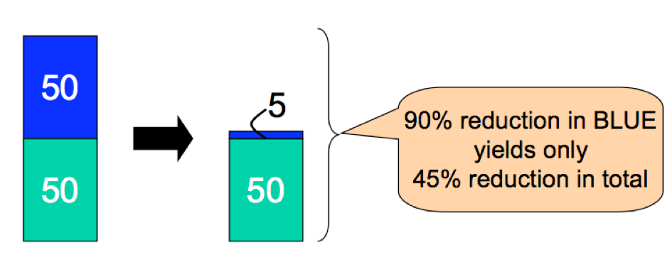
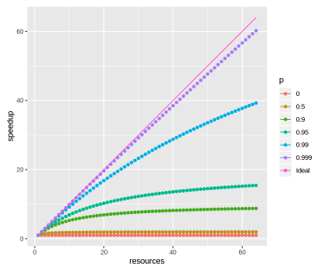
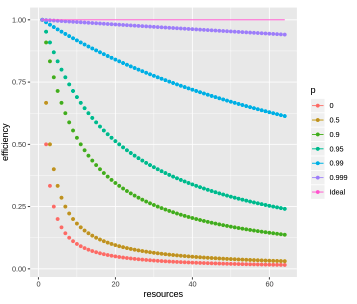

# Parallel Programming

My notes after taking Randal Burns's JHU CS 601.320/420/620 Parallel Programming course.

## Amdahl's Law

1. Speedup

   $$Speedup = \frac{T(1)}{T(n)}$$

   T(1) = time to execute task on a single resource. T(n) = time to execute task on n resources.

2. Amdahl's Law: theoretical speedup of the whole task is limited to the fraction can be improved

   $$Speedup = \frac{1}{1-p+\frac{p}{s}}$$

   - $$p$$ is the Amdahl's number, the proportion of execution time that benefits from improved resources, i.e. the parallel part
   - $$(1-p)$$ is the portion that does not benefit. i.e. the serial part
   - $$s$$ is the speedup of the optimized part. It is equivalent to the number of resources $$n$$.

   

   Speedup graph:

   

   Speedup upper limit is $$\frac{1}{1-p+\frac{p}{\infty}} = \frac{1}{1-p}$$

   Amdahl's Law usage:

   - Estimating scalability based on the original implementation of the serial program
   - Estimating Amdahl's number, the proportion of the parts that can be parallelized

3. Parallel Efficiency: Measures the efficiency of resources. It helps us decide how many resources we should put in.

   $$E = \frac{S(n)}{n} = \frac{T(1)}{nT(n)}$$

   

## OpenMP

1. OpenMP is a parallel programming environment that can easily bring parallelism to a serial program. It supports both master/slave and fork/join execution model. Its fundamental principle is block parallelism (parallelize a block and run multiple instances of the block with parallel threads). It is often used for loop parallelism by simply adding a directive line ontop the loop code block.

  - Merit: Incremental parallelism, simple to use, portable
  - Limitations: hard to manage memory usage, no distributed capabilities, no parallel I/O

## MapReduce (Hadoop and GFS)

[MapReduce](https://static.googleusercontent.com/media/research.google.com/en//archive/mapreduce-osdi04.pdf) is **a programming model** that is easily parallelized. Google's original implementation runs ontop GFS. The open-source Hadoop! implementation runs on HDFS. Some details worth mentioning:

1. Input/output domain: Map is a transformation. So a Mapper reads text and can output any key and value type. Reduce is a collection. So a Reducer output different value type but doesn't change the key type.
2. Sorting guarantee: When shuffling, data are route to Reducer based the hash of key to achieve load balancing. So it is not sorted globally. Within one partition at Reducer the keys are sorted.
3. Parallelism cap: For Map, it is up to number of input (usually number of files). For Reduce, it is up to number of keys.
4. Implementation: Master/workers model.
5. System Issues:
    - Master failure: Use checkpoint and restart
    - Failed worker: Heartbeat liveness detection and restart
    - Slow worker: Backup tasks
    - Locality of processing to data: Big deal and they don’t really solve. But much subsequent research does
    - Task granularity: Metadata size and protocol scaling (not inherent parallelism) limit the size of M and R
6. GFS:
    - Google's world-changing distributed file system.
    - Design for failures: Chunks are triple replicated.
    - Out of band: Metadata and data are separated. Master/Chunkservers model.
    - Append-only: Avoid contention to achieve good I/O.

## Resilient Distributed Datasets (Spark)

Notes for [https://www.usenix.org/system/files/conference/nsdi12/nsdi12-final138.pdf](https://www.usenix.org/system/files/conference/nsdi12/nsdi12-final138.pdf)

RDD is **a distributed memory abstraction** that lets programmers perform **in-memory** computations on large clusters. It is implemented in Spark at Berkeley. They use Scala because it is concise and efficiency (static typing). It is functional and RDD does not require it.

1. Compared to MapReduce: RDD provides distributed memory abstraction that allow easy reuse of intermediate results (less I/O). This is helpful in iterative ML algorithms and graph algorithms, and iteractive data mining.
   - MapReduce: one-time, functional programs and carries large I/O at every step
   - RDD: Pipelined operations (lazy materialization of datasets), encourages memory reuse
2. RDD abstraction: a **read-only**, partitioned collection of records.
   - Can only be created through **transformation** operation from data in stable storage or other RDDs. Examples of transformations: `map`, `filter`, `join`
   - RDD are not actual data: RDD is not materialized. Each RDD stores its lineage, the set of transformations from source. This allows easy reconstruction if there is a failure.
   - Tracking lineage: may think of it as a DAG graph. One important detail when implementing RDDs is the distinction between wide dependencies and narrow dependencies.
     - Wide: one parent partition may be used by multiple child partitions. All parent partitions must be available and shuffled to the correct child node before next step.
     - Narrow: one parent partition is used by at most one child partition. This is easily pipelined. Also it is easier to recover.
   - The persistence and partitioning strategy can be configured in RDDs.
3. Spark Interface of RDD: transformations + **actions** (return values to application or export data to a storage, examples are `reduce`, `count`, `collect`, `save`)
   - Lazy computation: pipelined transformations, only computed when there is an action.
   - Persist: Encourages memory reuse. May still spill to disk if not enough memory.
4. Implementations:
   - Job Scheduling: When an action is runned, scheduler generate a DAG of stages **separated by shuffle which is required in wide dependencies**. Tasks are assigned to machines based on data locality. In the original implementation, intermediate records are materialized just like MapReduce for wide dependencies.
   - Checkpointing: Though not required, user may choose to checkpoint if the lineage is too long or there are wide dependencies.

## GPU
